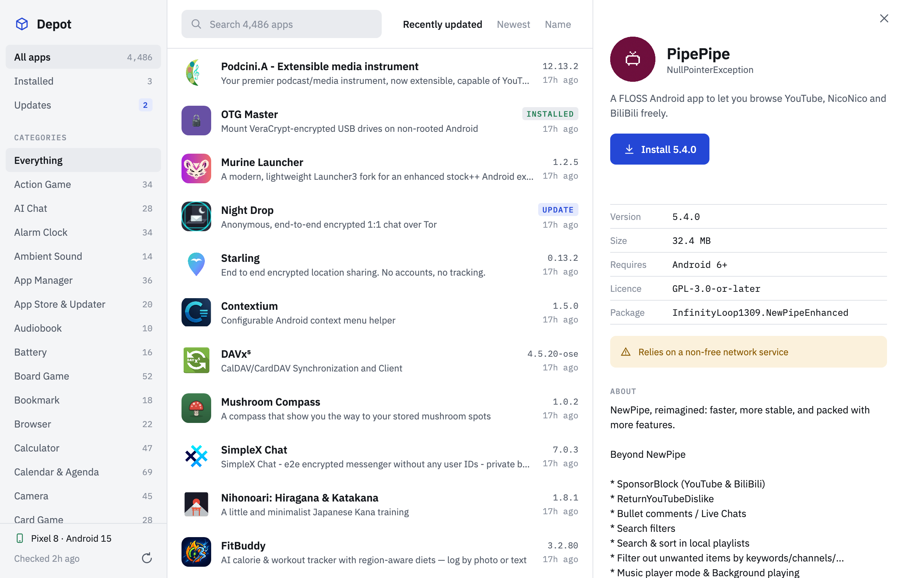

# Depot

A Compose Multiplatform client for the [F-Droid](https://f-droid.org) repository, for Android and desktop
(macOS, Windows, Linux). Depot is an independent project and is not affiliated with F-Droid.

- **Android** browses the catalogue and installs apps onto the phone it runs on.
- **Desktop** browses the catalogue and installs apps onto a phone connected with USB debugging, through `adb`.



## Status

Early. Read this before relying on it.

| | State |
|---|---|
| Desktop: sync, signature check, browse, search | Works against the live repository |
| Desktop: install through `adb` | Written, not yet run against a device |
| Android: everything | Builds, not yet run on a device |
| Extra repositories, mirrors, index diffs, auto-update | Not implemented |

## How it decides what to trust

1. `entry.jar` must be signed by the pinned F-Droid certificate.
2. The index must match the size and SHA-256 named in that entry, and may not be older than the stored one.
3. Every APK must match the size and SHA-256 named in the index before it reaches an installer.

Icons are fetched over HTTPS and are not hash-checked. [`SPEC.md`](SPEC.md) has the full rules, the version-choice
logic and the review notes.

## Build

Needs JDK 21 and the Android SDK (`sdk.dir` in `local.properties`).

```
./gradlew :desktopApp:run              # run the desktop app
./gradlew :androidApp:assembleDebug    # build the Android APK
./gradlew :shared:desktopTest          # run the tests
```

Desktop looks for `adb` in `$ANDROID_HOME`, `$ANDROID_SDK_ROOT`, the default SDK location, then `PATH`.

## Layout

- `shared/` — catalogue model and rules, repository sync and verification, install engine, Compose UI
- `androidApp/` — Android entry point
- `desktopApp/` — desktop entry point

## Licence

GPL-3.0-or-later, see [`LICENSE`](LICENSE). The bundled IBM Plex fonts are under the SIL Open Font License, see
[`licenses/IBM-Plex-OFL.txt`](licenses/IBM-Plex-OFL.txt). The test fixtures under
`shared/src/desktopTest/resources/fixtures/` are a small slice of the public F-Droid index and its signed entry file.
